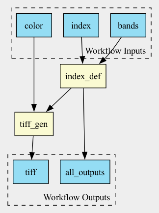

# CWL Provenance RunCrate Demo

This repository demonstrates a **reproducible, transparent workflow execution** using the Common Workflow Language (CWL), including the **generation of a PROV-compliant Provenance Run Crate** and an interactive HTML website to inspect results.

The example workflow calculates a vegetation index (e.g., GNDVI) from Sentinel-2 satellite bands using Python and CWL.



---

## 📦 Contents

```
.
├── Workflows/               # CWL workflow 
├── Workflows/Modules/       # CWL tool definitions
├── Workflows/Modules/Scripts/  # Python scripts used in the workflow
├── Workflow_inputs/         # YAML job file
├── Workflow_inputs/Data/    # Example Sentinel-2 data
├── provenance_output/       # Provenance generated via `cwltool --provenance provenance_output Workflows/workflow.cwl Workflow_inputs/GNDVI_10m.yaml`  
└── provenance_output.crate/ # Workflow Run Crate generated via `runcrate convert provenance_output`   
```

---

## 🚀 Quick Start

### 1. Clone the repository

```bash
git clone https://github.com/<your-username>/<repo-name>.git
cd <repo-name>
```

### 2. Create and activate a Python environment

```bash
python3 -m venv .venv
source .venv/bin/activate
pip install cwltool rocrate runcrate
```

---

## 🔁 Run the CWL Workflow

```bash
cwltool --provenance provenance_output Workflows/workflow.cwl Workflow_inputs/GNDVI_10m.yaml
```

This will:

- Run the CWL workflow
- Generate a provenance directory at `provenance_output/`

---

## 🔄 Convert to Workflow Run Crate

```bash
runcrate convert provenance_output
```

---

## 🌐 Create Crate Website

Install via npx (requires Node.js and npm):

```bash
npx ro-crate-html-js --directory provenance_output
```

To preview locally:

```bash
open provenance_output/index.html
```

---

## 🐳 Docker Requirements

Ensure Docker is installed and configured with sufficient memory. Some steps (e.g., TIFF generation) may require **up to 32 GB RAM**.

### On macOS or Windows:

- Open Docker Desktop
- Go to **Settings** → **Resources**
- Increase memory to **at least 32 GB**
- Click **Apply & Restart**

### On Linux:

- Check memory availability with `free -h`
- Use `dmesg | grep -i kill` to diagnose OOM (out-of-memory) errors
- If needed, configure swap or use a higher-memory instance

---

## 📚 References

- [Common Workflow Language](https://www.commonwl.org/)
- [RO-Crate](https://www.researchobject.org/ro-crate/)
- [runcrate](https://github.com/ResearchObject/runcrate)
- [ro-crate-html-js](https://www.npmjs.com/package/ro-crate-html-js)

---

## 📄 License

MIT License.
