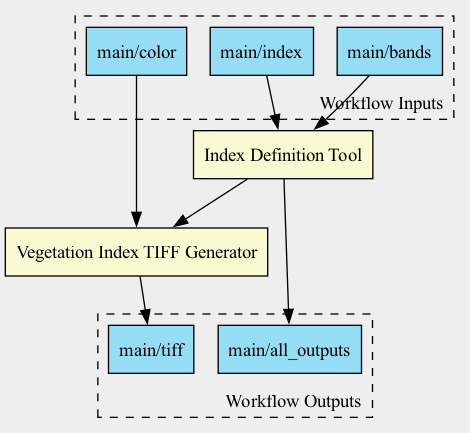

# **LivePublication Example: Chapter 4**

This repository demonstrates a **reproducible, transparent, and publishable computational workflow** using the Common Workflow Language (CWL) and the **LivePublication Framework**. It integrates three core components:

- **Experiment Infrastructure**: Automated data ingestion and CWL workflow execution
- **Interface**: Generation of standardised provenance and metadata crates
- **LivePaper**: Rendering a dynamic, data-responsive publication using a DNF (Dynamic Narrative Framework)
  - Uses the [Stencila engine](https://github.com/stencila/stencila)

The example workflow calculates the GNDVI vegetation index from Sentinel-2 satellite imagery and renders a corresponding LivePublication article.



---

## 📦 Directory Structure

```
.
├── Workflows/                     # CWL workflow definitions
├── Workflows/Modules/            # Individual CWL tool definitions
├── Workflows/Modules/Scripts/   # Python scripts for vegetation index analysis
├── Workflow_inputs/              # CWL input job file(s)
├── Workflow_inputs/Data/         # Sentinel-2 .SAFE data
├── provenance_output/            # Provenance output from CWL
├── provenance_output.crate/      # Workflow Run Crate (RO-Crate with provenance)
├── interface.crate/              # Interface Crate for rendering publications
├── docs/                         # Templated HTML site renderer
├── DNF_document.json             # Data-driven article definition (DNF)
├── dynamic_article.json          # Fully rendered LivePublication article
```

---

## 🚀 Quick Start

### 1. Clone the Repository

```bash
git clone https://github.com/<your-username>/<repo-name>.git
cd <repo-name>
```

### 2. Set Up Your Environment

Create and activate a Python virtual environment:

```bash
python3 -m venv .venv
source .venv/bin/activate
pip install cwltool rocrate runcrate
```

Install the HTML preview tool:

```bash
npm install -g ro-crate-html-js
```

---

## 🛣️ Run the Full LivePublication Pipeline

To run the complete LivePublication process—from data retrieval to rendered publication—execute:

```bash
./publish_pipeline.sh
```

This script will:

1. 🧹 Clean the project directory of prior outputs
2. 🛰️ Download new Sentinel-2 data using `copernicus_data.py`
3. ▶️ Execute the CWL workflow with provenance tracking
4. 📦 Convert the output into a **Provenance Run Crate**
5. 🖼️ Generate a workflow diagram and embed it into the crate
6. ☁️ Upload results to Zenodo (optional; requires token)
7. 🧬 Generate the **Interface Crate**
8. 🌐 Generate HTML previews of the crates (via `rochtml`)
9. 🧱 Build the templated website from metadata and results
10. 📄 Convert the `.smd` DNF specification into a **DNF Document**
11. 📑 Render the **DNF Document** into a publication-ready article
12. 📤 Commit and push the update to GitHub

---

## 🧪 Run Workflow Manually (Advanced)

### Run the Workflow with Provenance

```bash
cwltool --provenance provenance_output Workflows/workflow.cwl Workflow_inputs/GNDVI_10m.yaml
```

### Convert to a Workflow Run Crate

```bash
runcrate convert provenance_output --output provenance_output.crate
```

### Generate Workflow Diagram

```bash
cwltool --print-dot provenance_output.crate/packed.cwl | dot -Tpng -o workflow_preview.png
cp workflow_preview.png provenance_output.crate/workflow_preview.png
```

### Generate HTML Crate Preview

```bash
rochtml provenance_output.crate/ro-crate-metadata.json
rochtml interface.crate/ro-crate-metadata.json
```

### Render the DNF Publication

```bash
stencila convert dynamic_publication.smd DNF_document.json
stencila render --no-save DNF_document.json dynamic_article.json
```

---

## 🐳 Docker Requirements

Ensure Docker is installed and has **at least 32 GB RAM** configured:

### On macOS or Windows:

- Docker Desktop → **Settings** → **Resources** → **Memory**
- Set to **32 GB** and click **Apply & Restart**

### On Linux:

- Check memory: `free -h`
- Diagnose OOM errors: `dmesg | grep -i kill`

---

## ☁️ Zenodo Integration (Optional)

To enable automatic uploads, create a file `zenodo_token.py` with:

```python
token = "your_zenodo_access_token"
```

---

## 📚 References

- [Common Workflow Language (CWL)](https://www.commonwl.org/)
- [RO-Crate](https://www.researchobject.org/ro-crate/)
- [runcrate](https://github.com/ResearchObject/runcrate)
- [ro-crate-html-js](https://github.com/UTS-eResearch/ro-crate-html-js)
- [Stencila](https://github.com/stencila)

---

## 📄 License

MIT License.
